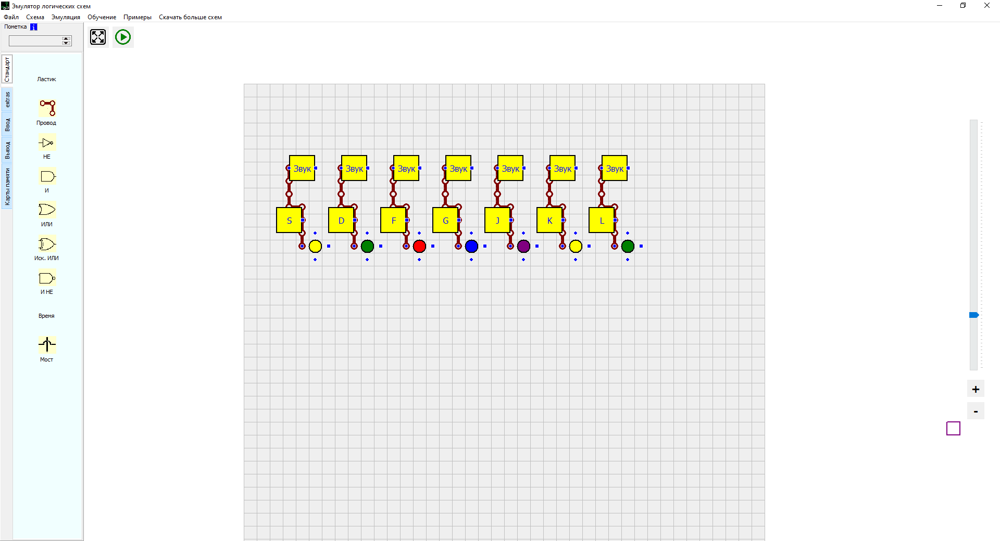
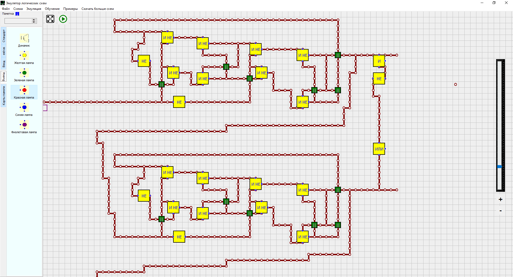
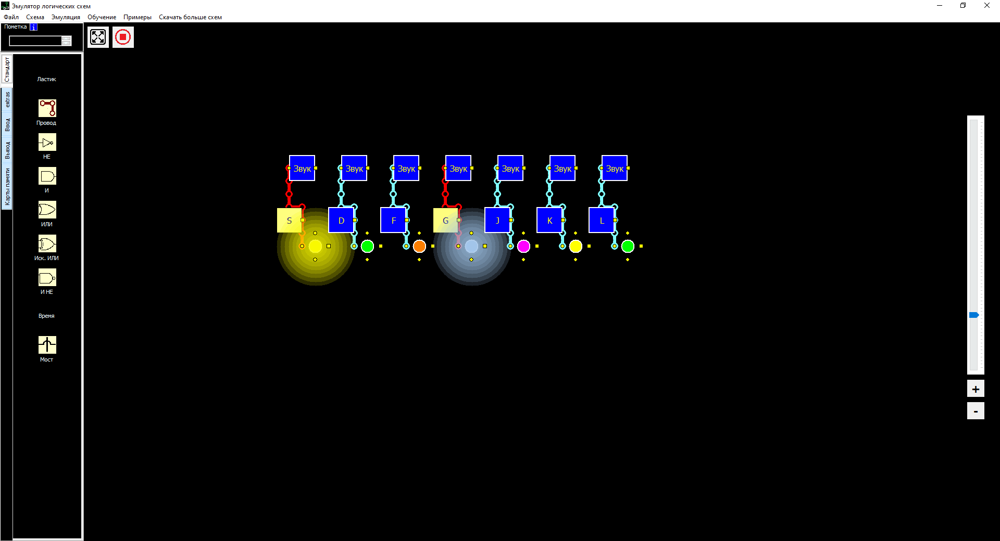

## LogicSchemeEmulator
A simple emulator of logical elements

A project from 2017. You can simulate logical schemas by building chains of logical gates. There're also lamps of a few colors, speakers, key-triggers, and some other stuff. There's even a scheme market!

### Simple piano with key triggers

### Complicated scheme for music replay

### Dark theme + a few lamps turned on
